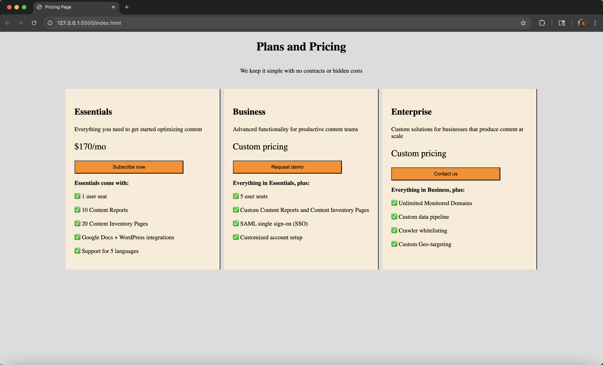
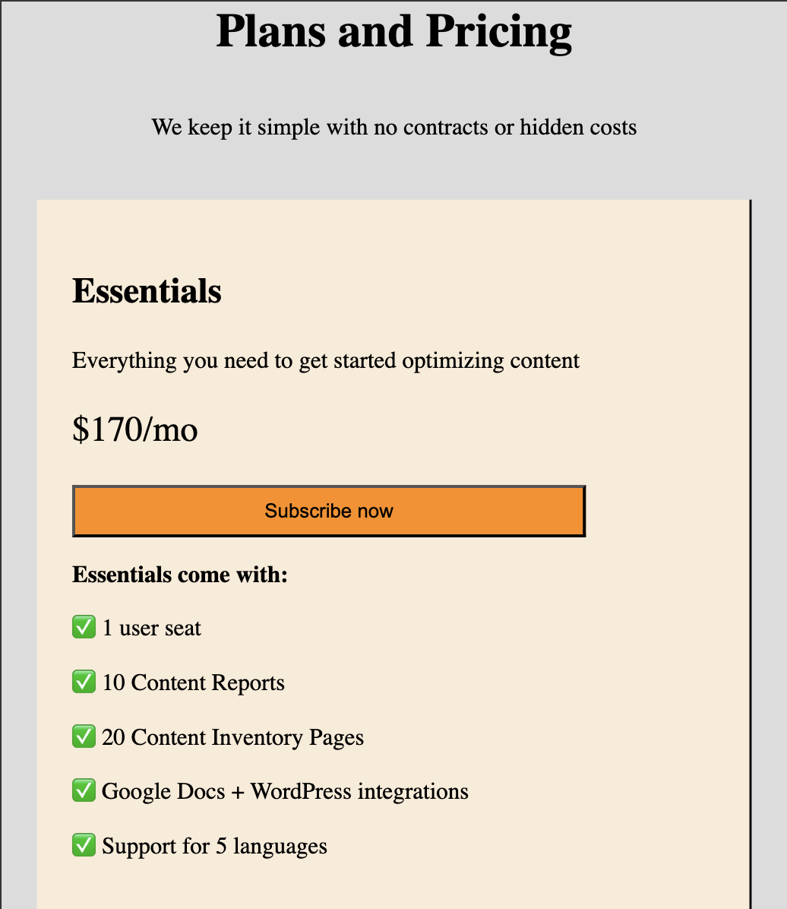

## Pricing Page Layout

This is a static, responsive pricing page created with HTML and CSS to practice layout design and visual hierarchy. It includes multiple pricing tiers displayed side-by-side on desktop and stacked on mobile.

## Goals

-   Build a clean, modern pricing section commonly used in SaaS websites
-   Use Flexbox or CSS Grid for horizontal alignment
-   Learn to apply consistent spacing, card structure, and call-to-action buttons
-   Emphasize one plan visually to guide user attention

## Features

-   **Responsive Design**: Columns stack vertically on small screens
-   **Reusable CSS**: Repeated card styles using classes

## Screenshots

Desktop View 
Mobile View 
